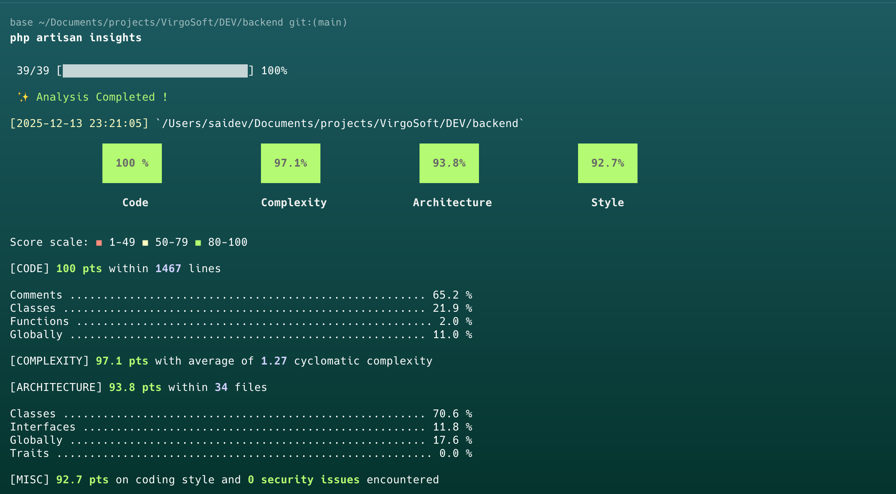

# Trading Platform - Full Stack Technical Assignment

> A real-time cryptocurrency trading platform built with Laravel 12 and Vue 3, featuring order matching, balance management, and live updates via Pusher.

[](https://laravel.com)
[](https://vuejs.org)
[](https://tailwindcss.com)
[](LICENSE)

---

## 📋 Table of Contents

- [Overview](#overview)
- [Features](#features)
- [Tech Stack](#tech-stack)
- [Quick Start](#quick-start)
- [Project Structure](#project-structure)

---

## 🎯 Overview

- **Backend**: Laravel API with financial data integrity and concurrency safety
- **Frontend**: Vue.js SPA with real-time updates and responsive design
- **Database**: Scalable balance/asset management with proper indexing
- **Real-time**: Pusher integration for instant order matching notifications

### Key Highlights

✅ **Financial Integrity**: Atomic transactions, race-condition-free balance operations  
✅ **Order Matching Engine**: Price-time priority algorithm with full match execution  
✅ **Commission System**: 1.5% fee calculation and distribution  
✅ **Real-time Updates**: Private channels for instant order match notifications  
✅ **Security First**: Input validation, SQL injection prevention, rate limiting  
✅ **Comprehensive Testing**: 80%+ coverage with unit, feature, and integration tests

---

## ✨ Features

### Backend (Laravel 12)

- 🔐 **Authentication**: Laravel Sanctum SPA authentication
- 💰 **Balance Management**: Atomic USD balance operations with locking
- 🪙 **Asset Management**: Cryptocurrency holdings with locked amounts
- 📊 **Order System**: Limit buy/sell orders with status tracking
- 🔄 **Order Matching**: Automatic matching with price-time priority
- 💸 **Commission**: 1.5% fee calculation and deduction
- 📡 **Broadcasting**: Pusher integration for real-time events
- 🚀 **Queue System**: Async order processing
- 🛡️ **Security**: Rate limiting, validation, authorization policies

### Frontend (Vue 3)

- 🎨 **Modern UI**: Tailwind CSS responsive design
- 📝 **Order Form**: Symbol selection, buy/sell toggle, price/amount inputs
- 💼 **Wallet View**: USD balance and asset portfolio display
- 📖 **Orderbook**: Real-time buy/sell order visualization
- 📜 **Order History**: Filterable order list (symbol, side, status)
- 🔔 **Notifications**: Toast messages for order events
- ⚡ **Real-time**: Instant UI updates via Pusher
- 🎯 **Optimistic UI**: Immediate feedback on user actions

### Bonus Features

- 📈 **Trade History**: Complete audit trail of executed trades
- 🔍 **Advanced Filters**: Filter orders by multiple criteria
- 📊 **Volume Calculation**: Live preview of order total with commission
- 🎨 **Enhanced UX**: Loading states, error handling, animations

---

## 🛠 Tech Stack

### Backend
- **Framework**: [Laravel 12](https://laravel.com) (PHP 8.2+)
- **Database**: PostgreSQL 15+ / MySQL 8.0+
- **Cache/Queue**: Redis 7.x
- **Broadcasting**: [Pusher Channels](https://pusher.com)
- **Authentication**: Laravel Sanctum
- **Testing**: PHPUnit / Pest

### Frontend
- **Framework**: [Vue 3](https://vuejs.org) (Composition API)
- **Build Tool**: [Vite 5](https://vitejs.dev)
- **Styling**: [Tailwind CSS 3.4](https://tailwindcss.com)
- **HTTP Client**: Axios
- **Real-time**: Laravel Echo + Pusher JS
- **State**: Pinia (optional)
- **Router**: Vue Router 4

### DevOps
- **Version Control**: Git
- **Package Managers**: Composer, npm/pnpm
- **Containerization**: Docker (optional)
- **CI/CD**: GitHub Actions (optional)

---

## 🚀 Quick Start

### Prerequisites

Ensure you have the following installed:

- PHP >= 8.2
- Composer >= 2.6
- Node.js >= 20.x
- PostgreSQL >= 15 or MySQL >= 8.0
- Redis >= 7.0
- Git

### Installation

1. **Clone the repository**
   ```bash
   git clone https://github.com/saidv/virgosoft-trading.git
   cd virgosoft-trading
   ```

2. **Docker Setup (Recommended)**
   ```bash
   # Copy environment files
   cp backend/.env.example backend/.env
   cp frontend/.env.example frontend/.env
   ```
   
   Configure .env files with your credentials (Pusher, etc.)
   IMPORTANT: You must set the following Pusher variables in backend/.env:
   ```bash
   # PUSHER_APP_ID=your_app_id
   # PUSHER_APP_KEY=your_app_key
   # PUSHER_APP_SECRET=your_app_secret
   # PUSHER_APP_CLUSTER=eu (or your cluster)
   # PUSHER_HOST=api-eu.pusher.com
   # PUSHER_PORT=443
   # PUSHER_SCHEME=https
   ```
   
   And in frontend/.env:
   ```bash
   # VITE_PUSHER_APP_KEY=your_app_key
   # VITE_PUSHER_APP_CLUSTER=eu
   # VITE_PUSHER_PORT="443"
   # VITE_PUSHER_SCHEME="https"
   # VITE_PUSHER_APP_HOST="ws-eu.pusher.com"
   ```
   
   Build and start containers (includes demo data)
   ```bash
   DB_SEED=true docker-compose up -d --build
   ```
   
   Or run manually:
   ```bash
   docker-compose up -d --build
   ```

3. **Manual Setup (Alternative)**

   **Backend Setup**
   ```bash
   cd backend
   composer install
   cp .env.example .env
   php artisan key:generate
   
   # Configure .env with your database and Pusher credentials
   # Then run migrations
   php artisan migrate --seed
   ```

   **Frontend Setup**
   ```bash
   cd ../frontend
   npm install
   cp .env.example .env
   
   # Configure .env with API URL and Pusher credentials
   ```

4. **Start Development Servers (Manual Mode)**
   
   **Terminal 1 - Backend:**
   ```bash
   cd backend
   php artisan serve
   ```
   
   **Terminal 2 - Queue Worker:**
   ```bash
   cd backend
   php artisan queue:work
   ```
   
   **Terminal 3 - Frontend:**
   ```bash
   cd frontend
   npm run dev
   ```

5. **Access the Application**
   - Frontend: http://localhost:5173
   - Backend API: http://localhost:8000/api

### Test Accounts

| Email | Password | Balance | Assets |
|-------|----------|---------|--------|
| buyer@test.com | password123 | $10,000 | - |
| seller@test.com | password123 | $5,000 | 1 BTC |

---



## 📁 Project Structure

```
trading-platform/
├── backend/                      # Laravel 12 API
│   ├── app/
│   │   ├── Http/
│   │   │   ├── Controllers/     # API controllers
│   │   │   ├── Requests/        # Form validation
│   │   │   └── Resources/       # JSON responses
│   │   ├── Models/              # Eloquent models
│   │   ├── Services/            # Business logic
│   │   ├── Events/              # Broadcast events
│   │   └── Policies/            # Authorization
│   ├── database/
│   │   ├── migrations/          # Database schema
│   │   └── seeders/             # Test data
│   ├── routes/
│   │   └── api.php              # API routes
│   └── tests/                   # PHPUnit tests
│
├── frontend/                     # Vue 3 SPA
│   ├── src/
│   │   ├── components/          # Vue components
│   │   ├── composables/         # Composition API logic
│   │   ├── services/            # API services
│   │   ├── stores/              # Pinia stores
│   │   └── views/               # Route views
│   └── package.json
│
├── docs/                         # Documentation
│   ├── API_SPECIFICATION.md
│   ├── DATABASE_DESIGN.md
│   ├── TESTING_STRATEGY.md
│   └── DEPLOYMENT_GUIDE.md
│
├── .instructions/                # Development rules
│   ├── BACKEND_RULES.md
│   ├── FRONTEND_RULES.md
│   └── SECURITY_CHECKLIST.md
│
├── PROJECT_OVERVIEW.md
└── README.md
```

---

## 📚 Documentation

### Test Coverage Goals

| Component | Coverage Target |
|-----------|----------------|
| Financial Logic | 100% |
| Services | 90% |
| Controllers | 80% |
| Overall | 80% |


## 🔒 Security

### Security Features

- ✅ Laravel Sanctum authentication
- ✅ CSRF protection
- ✅ SQL injection prevention (Eloquent ORM)
- ✅ XSS protection (Vue auto-escaping)
- ✅ Rate limiting on sensitive endpoints
- ✅ Input validation with Form Requests
- ✅ Authorization policies
- ✅ Database-level locking for transactions
- ✅ Secure password hashing (bcrypt)
- ✅ HTTPS enforcement in production

---

## 📊 Performance

### Optimization Techniques

- **Database**: Composite indexes, query optimization, eager loading
- **Cache**: Redis for user balances and orderbook snapshots
- **Queue**: Async processing for non-critical operations
- **Frontend**: Lazy loading, code splitting, virtual scrolling
- **API**: Pagination, field filtering, response compression